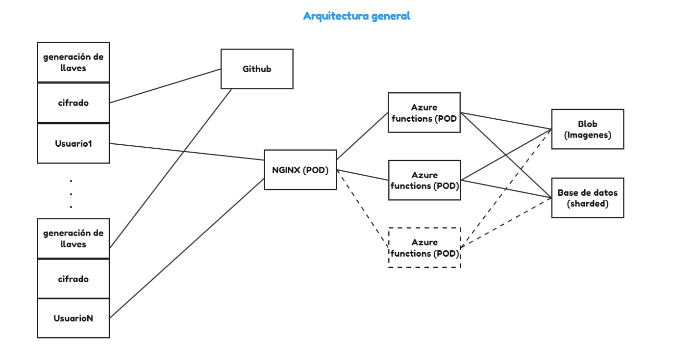

## Integrantes:

- Eric Bracamonte 
- Grover Ugarte

## Descripcion
Segunda iteración del frontend AnyTwitter. Se implementa la arquitectura:

## Deployment 

Se uso la plataforma de Vercel para hacer el deploy, los pasos a seguir son forkear este proyecto e importarlo en la misma [página](https://vercel.com/new?utm_medium=default-template&filter=next.js&utm_source=create-next-app&utm_campaign=create-next-app-readme).

<!-- Check out our [Next.js deployment documentation](https://nextjs.org/docs/deployment) for more details. -->
